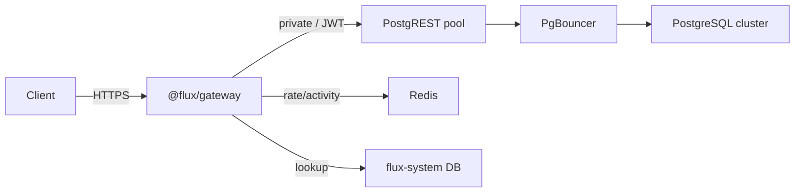

# Flux v2 — Architecture Specification

> **Status:** Authoritative design document. Treat invariants and contracts below as code-review
> gates, not suggestions. Implementation is incremental; the doc describes the target state.

---

## Invariants

These rules are unconditional. Violating them in code review is a blocker.

| # | Invariant |
|---|-----------|
| 1 | `tenant_id` (UUID) is **immutable**. Slug is UI-only and may change. |
| 2 | Postgres schema and role names are derived **only** from `tenant_id` via a deterministic `shortid`. Slug is **never** embedded in a schema or role identifier. |
| 3 | The **gateway is the only issuer of runtime JWTs** for tenant API traffic. |
| 4 | **PostgREST is never publicly reachable.** Only the gateway has a network path to it. |
| 5 | **Redis is never authoritative.** It is cache and best-effort telemetry. Wiping Redis must not affect data correctness. |
| 6 | **Never enumerate per-tenant schemas in `PGRST_DB_SCHEMAS`** (e.g. `t_abc_api,t_xyz_api`). This is a security footgun. Access is controlled by role grants, `search_path`, and JWT `role`. |

---

## 1. Overview

Flux v2 introduces a **shared-infrastructure execution strategy** alongside the existing dedicated
per-project container model (v1). It does not replace v1—both coexist indefinitely in one
codebase, selected by an explicit `mode` field in the system database.

### Why

Flux v1 provisions one PostgreSQL container and one PostgREST container per project. This is the
correct default for Enterprise-grade isolation and compliance workloads. At scale, however, it
produces:

- **Container explosion** — hundreds of Docker containers on a single host.
- **Memory pressure** — each PostgREST process carries baseline RAM independently of tenant
  activity.
- **Docker/network limit friction** — bridge networks, host-port maps, and label counts all have
  practical ceilings.

Flux v2 addresses Free and Pro tiers by sharing a PostgreSQL cluster and a PostgREST pool across
tenants while preserving logical data isolation at the schema and role level.

### Scope of this document

- Locked design decisions for v2 (shared path).
- Engine abstraction that allows v1 and v2 to coexist.
- Contracts that every implementation **must** satisfy (JWT, PostgREST, naming, Redis).
- Open risks requiring future resolution.

---

## Portable tenant backups (user-facing export)

Users can run **`flux backup create` / `list` / `download` / `verify`** for **v2_shared** projects. The control plane runs **`pg_dump -Fc --schema=t_<shortId>_api --no-owner --no-acl`** against **`FLUX_SHARED_POSTGRES_URL`**, so the artifact contains **only** that tenant schema—not other tenants, not cluster-global objects.

- **Trust boundary:** this is a **portable tenant export**, restorable into any Postgres for migrations or off-platform analysis. It does **not** replace **cluster-level** backup/restore for operators (physical backups, WAL archiving, PITR).

- **Verification:** unchanged from v1 — the same **`pg_restore`** smoke test in a disposable Postgres container validates the custom-format file.

- **Catalog:** backup rows carry **`kind = tenant_export`** (vs **`project_db`** for v1 full-database dumps).

Automatic nightly backups remain **v1-only** in the MVP scheduler; v2 exports are **on-demand** unless extended later.

---

## 2. Threat model

### Primary security boundary

```
Gateway → (short-lived JWT containing role + tenant_id) → PostgREST → per-tenant schema
```

The chain works because:

1. The gateway resolves the request's hostname to a `tenant_id`, then mints a JWT carrying
   `role = t_<shortid>_role`.
2. PostgREST uses the JWT `role` claim to set the Postgres connection role.
3. That role has `USAGE` only on `t_<shortid>_api` and cannot read other tenants' schemas.

### Soft isolation (Free / Pro)

Free and Pro tiers accept **cluster-level blast radius** as a deliberate design tradeoff. A
misbehaving tenant can degrade the shared cluster; hard per-tenant isolation (resource groups,
dedicated pools) is not the goal at this tier. Mitigations:

| Control | Location | Effect |
|---------|----------|--------|
| PgBouncer transaction pooling | data plane | caps peak connections |
| `CONNECTION LIMIT N` per role | Postgres | prevents single-tenant connection exhaustion |
| `statement_timeout` per role | Postgres | kills runaway queries before cluster impact |
| Per-tenant rate limit | gateway + Redis | stops traffic bursts before they hit the DB |
| Horizontal cluster scaling | ops | moves tenants to new clusters when a cluster is hot |

No row-level security (RLS) is applied initially. RLS adds per-query planning overhead and
implementation complexity; the schema + role + `search_path` boundary is sufficient for the v2
threat model.

### #1 risk: JWT mis-issuance

**An incorrect `role` or `tenant_id` in a gateway-issued JWT causes cross-tenant data access.**
There is no further database-level guard. Gateway implementation correctness is therefore a
**critical security control**, not a convenience layer.

Mitigations:
- The gateway is the only code path that issues runtime JWTs (invariant 3).
- `tenant_id` is validated against the system DB on every resolution; the JWT reflects the DB
  record, not a user-supplied value.
- Short JWT TTL (1–5 minutes) limits the window for a mis-issued token.

### What is explicitly not promised

- RLS: not required initially; may become an opt-in feature for Pro+.
- Per-tenant noisy-neighbor SLA: that is an Enterprise (v1) guarantee.
- HIPAA / SOC 2 on shared infra: Enterprise (dedicated) is the compliance boundary.

---

## 3. v1 vs v2 comparison

| Dimension | v1 (dedicated) | v2 (shared) |
|-----------|----------------|-------------|
| Postgres | One container per project | Shared cluster; schema per tenant |
| PostgREST | One container per project | Pool of 2–4 instances |
| Network | Per-tenant Docker bridge | Single internal network |
| Isolation | Container / OS boundary | Schema + role + `search_path` |
| JWT issuer | Control plane (PostgREST `PGRST_JWT_SECRET`) | Gateway |
| Blast radius | Single container | Entire shared cluster |
| Compliance | SOC2/HIPAA-ready | Not a compliance boundary |
| Scaling unit | Container (fine-grained) | Cluster (coarse) |
| Cost/tenant | Higher (dedicated resources) | Lower (shared capacity) |
| Ops complexity | High (container lifecycle) | Lower (schema/role lifecycle) |

**v1 and v2 coexist indefinitely. v2 is an additional execution strategy, not a replacement.
v1 is not deprecated.**

---

## 4. Request flow

### v2 (shared path)

```
Client
  │
  ▼
Gateway (@flux/gateway)
  ├─ Resolve hostname → tenant_id (system DB; Redis cache)
  ├─ Enforce rate limit  rate:{tenant_id}  (Redis, fail-open)
  ├─ Mint short-lived JWT  { role, tenant_id, exp }
  └─ Best-effort INCR  activity:{tenant_id}  (Redis, never blocks)
  │
  ▼ (private network only)
PostgREST pool  (2–4 instances)
  │
  ▼
PgBouncer  (transaction pooling)
  │
  ▼
PostgreSQL shared cluster
  └─ Schema: t_<shortid>_api   (tenant-scoped)
  └─ Role:   t_<shortid>_role  (tenant-scoped)
```



### v1 (dedicated path)

Unchanged from the current architecture: client → Traefik → per-tenant PostgREST → dedicated
Postgres container.

---

## 5. System components

### Control plane

| Component | Role |
|-----------|------|
| `flux-system` Postgres | Canonical record of all projects, tenants, domains, plans, modes |
| `@flux/core` | Orchestration: engine registry, project types, control-plane wiring |
| `apps/dashboard` | UI + API routes; reads `mode` from `flux-system` to select engine |
| `@flux/cli` | Thin wrapper over `@flux/core`; never contains DB or gateway logic |

The canonical project row includes:

```json
{
  "tenant_id": "c1f3c9c2-4e3b-...",
  "slug": "acme",
  "mode": "v2_shared",
  "plan": "free",
  "status": "active",
  "created_at": "..."
}
```

`mode` is always explicit. Provisioning logic **must not** infer it solely from `plan`.

### Data plane

| Component | Role |
|-----------|------|
| PostgreSQL shared cluster | Tenant data, one schema per tenant |
| PgBouncer | Connection pool in transaction mode |
| PostgREST pool (2–4) | HTTP API; receives JWTs from gateway only |
| `@flux/gateway` | Resolve, rate-limit, sign JWT, proxy |

### Redis

Redis is **cache and best-effort telemetry only**:

| Key | Purpose | Authoritative? |
|-----|---------|----------------|
| `rate:{tenant_id}` | Fixed-window inference/request counter | No |
| `activity:{tenant_id}` | Heartbeat INCR for `last_accessed_at` flush | No |
| `hostname:{host}` | Tenant resolution cache | No (DB is truth on miss) |

Redis must be safe to wipe without data loss. Gateway must not depend on Redis for correctness
of tenant resolution.

---

## 6. Gateway responsibility boundary

### Does

- Resolve hostname or custom domain → `tenant_id` (system DB lookup; Redis as read-through cache).
- Apply per-tenant rate limit. Return **HTTP 429** if limit is exceeded; **do not forward** the
  request upstream.
- Mint a short-lived runtime JWT (`role`, `tenant_id`, `exp`).
- Proxy the request to a PostgREST instance on the private network.
- Best-effort `INCR activity:{tenant_id}` (see Redis guardrail below).

### Does not

- Contain business logic.
- Write to any database (system DB is read-only from the gateway).
- Manage tenant lifecycle (create schema, set limits, rotate credentials).
- Become a "mini control plane"—this is a gateway, not a general-purpose API server.

### Redis guardrail — non-blocking pattern

Redis calls in the gateway hot path are best-effort. **Never** let a Redis error abort the
primary request.

**Anti-pattern (do not do this):**
```typescript
await redis.incr(key); // uncaught timeout propagates → broken request
```

**Correct pattern:**
```typescript
try {
  await redis.incr(key);
} catch {
  // swallow; log metric if needed; continue
}
```

This applies to rate-limit checks, activity INCRs, and cache writes.

---

## 7. JWT contract

### Runtime JWT (gateway-issued, tenant API traffic)

```json
{
  "role": "t_<shortid>_role",
  "tenant_id": "c1f3c9c2-4e3b-...",
  "exp": 1716000300
}
```

| Field | Value | Notes |
|-------|-------|-------|
| `role` | `t_<shortid>_role` | Matches Postgres role exactly |
| `tenant_id` | UUID from `flux-system` | Informational; not used for DB routing |
| `exp` | `now + 1–5 min` | Short TTL; must be enforced by PostgREST |

**Only the gateway mints runtime JWTs.** No other service or endpoint may issue a token in this
shape for production API traffic.

**Split keys (pooled data plane):** The single `PGRST_JWT_SECRET` on `flux-postgrest-pool` must
match the gateway's pool signing key for **upstream** HS256 tokens only. Each project also has a
distinct `jwt_secret` in the `flux-system` `projects` table: tenant applications sign end-user or
service JWTs with that secret; the gateway verifies them when `Authorization: Bearer` is present.
Those tenant-scoped secrets are **not** the pool secret and are never copied into PostgREST env.

### Admin / service JWT (control plane)

Issued by the control plane for migrations, internal operations, and schema setup. These tokens
use a different `role` (e.g. `postgres` or a service role) and **must not** be exposed to the
public API path.

---

## 8. PostgREST behavior

### Configuration policy

```
PGRST_DB_SCHEMAS=public
PGRST_DB_ANON_ROLE=anon
```

`PGRST_DB_SCHEMAS` lists schemas PostgREST **introspects and exposes**. **Never** enumerate
per-tenant schemas here:

```
# FORBIDDEN — security footgun
PGRST_DB_SCHEMAS=t_abc12345_api,t_def67890_api
```

Why this is forbidden: doing so widens PostgREST's introspection surface to all listed schemas
and makes tenant isolation dependent on client-supplied JWT claims alone, with no structural
containment.

### How tenant access actually works

1. Gateway mints JWT with `role = t_<shortid>_role`.
2. PostgREST sets `SET ROLE t_<shortid>_role` on the connection before executing the query.
3. The role's `search_path` is set to `t_<shortid>_api`. Only objects in that schema are visible.
4. GRANTs on `t_<shortid>_api` are set to `t_<shortid>_role` only; no cross-tenant visibility.

### Transaction pooling requirement

PostgREST connects through PgBouncer in **transaction pooling mode**. All tenant SQL must be
**stateless across requests**:

- No `CREATE TEMP TABLE` across request boundaries.
- No advisory locks held across requests.
- No reliance on `SET` variables persisting between requests.

Violating these constraints produces non-deterministic bugs that are hard to reproduce. Document
this constraint to end-users and API consumers.

---

## 9. Engine abstraction

The engine abstraction allows the control plane to select an execution strategy (v1 or v2)
based on the project's `mode` field, without branching throughout the application.

### All engines (shared interface)

| Method | Signature | Notes |
|--------|-----------|-------|
| `provisionProject` | `(slug, tenantId, opts) → ProjectInfo` | Idempotent |
| `deleteProject` | `(slug) → void` | Removes all resources |
| `suspendProject` | `(slug) → void` | v2: stop JWT issuance / rate-limit to zero; v1: stop containers |
| `getApiUrl` | `(slug) → string` | Returns public API URL |
| `getCredentials` | `(slug) → Credentials` | Returns connection/auth details |
| `setEnv` | `(slug, key, value) → void` | Set runtime env var |
| `listEnv` | `(slug) → Record<string, string>` | List env vars |
| `importSql` | `(slug, sql) → void` | Run SQL against tenant's database |

### v2-only methods

| Method | Notes |
|--------|-------|
| `createTenantSchema` | `CREATE SCHEMA t_<shortid>_api` |
| `createTenantRole` | `CREATE ROLE t_<shortid>_role LOGIN ...` with `CONNECTION LIMIT` and `statement_timeout` |
| `assignTenantMetadata` | Write `mode`, `shortid`, `cluster` ref back to `flux-system` |

### v1-only methods

| Method | Notes |
|--------|-------|
| `createContainers` | Provision Postgres + PostgREST Docker containers |
| `manageDockerNetworks` | Create/join/leave per-tenant bridge network |

### Execution model

All engines are **imperative**. There is no reconciliation loop at this stage. Desired state is
not continuously asserted; operations are triggered by explicit control-plane calls. A future
`reconcile` endpoint may be added once the operational model is stable.

---

## 10. Tenant naming and identity

### Identity hierarchy

| Concept | Format | Stability |
|---------|--------|-----------|
| `tenant_id` | UUID v4 | Immutable |
| `slug` | Human-readable, URL-safe | Mutable (UI label) |
| `shortid` | Deterministic from `tenant_id` | Immutable (derived) |

### `shortid` derivation

`shortid` is the **first 12 hex characters** of the `tenant_id` UUID with hyphens removed.

```
tenant_id  = "c1f3c9c2-4e3b-4b2a-9a1d-0f1e2d3c4b5a"
uuid_hex   = "c1f3c9c24e3b4b2a9a1d0f1e2d3c4b5a"
shortid    = "c1f3c9c24e3b"                           # first 12 hex chars
```

12 hex characters = 48 bits of entropy. The probability of a collision across 2,000 tenants in
a single cluster is negligible (`2000² / 2 × 2^48 ≈ 1.4 × 10⁻⁹`).

### Derived identifiers

```
schema  →  t_c1f3c9c24e3b_api
role    →  t_c1f3c9c24e3b_role
```

These fit comfortably within the PostgreSQL 63-byte identifier limit (`t_` + 12 + `_api` = 18
bytes).

### Redis key convention

```
rate:{tenant_id}        →  rate:c1f3c9c2-4e3b-4b2a-9a1d-0f1e2d3c4b5a
activity:{tenant_id}    →  activity:c1f3c9c2-4e3b-4b2a-9a1d-0f1e2d3c4b5a
hostname:{host}         →  hostname:acme.flux.app
```

Redis keys use the **full UUID** for clarity and collision-safety in the key namespace.
Postgres identifiers use the shorter `shortid` to stay within length limits.

---

## 11. Redis and rate limiting

### Rate limiting

- **Algorithm:** fixed window per tenant per hour.
- **Key:** `rate:{tenant_id}`.
- **Limit:** configurable per tier (default: see tier table in §15).
- **On exceed:** gateway returns **HTTP 429**; request is **not** forwarded to PostgREST.
- **Redis unavailable (default):** **fail-open**—allow the request. Availability over strict
  enforcement during cache outages. The gateway must never block on Redis for correctness.
- **Future tier option:** Enterprise or Pro+ may opt into fail-closed or hybrid enforcement
  when Redis is unavailable. Default behavior remains fail-open for Free/Pro.

### Activity tracking

- Gateway executes `INCR activity:{tenant_id}` with a TTL (60 s rolling window).
- A **flush worker** runs every 30–60 seconds:
  ```sql
  UPDATE projects
  SET    last_accessed_at = NOW()
  WHERE  tenant_id IN (<recently_active_list>);
  ```
- **Redis unavailable:** skip the INCR; do not block or fail the request. Activity loss is
  acceptable (lossy by design).
- **Redis wiped:** `last_accessed_at` is the durable record in Postgres. No activity data is
  lost beyond the unflushed window.

### Redis non-blocking guardrail

See §6 (Gateway responsibility boundary) for the code pattern. This applies to all Redis calls
in the gateway request path: rate-limit INCR, activity INCR, and cache writes.

---

## 12. Custom domains

Tenants may map custom hostnames to their project.

### Storage

```sql
-- flux-system
CREATE TABLE domains (
  hostname    TEXT PRIMARY KEY,
  tenant_id   UUID NOT NULL REFERENCES projects(tenant_id),
  verified_at TIMESTAMPTZ
);
```

### Gateway resolution

1. Gateway receives request on `Host: custom.example.com`.
2. Check Redis: `GET hostname:custom.example.com`.
3. On miss: query `flux-system.domains`, populate Redis cache.
4. On Redis unavailable: skip cache, query DB directly.

### Cache invalidation

**On domain create, update, or delete:** the control plane must **explicitly evict**
`hostname:{old_host}` from Redis. Relying on TTL expiry alone produces stale routing for the
TTL window.

```typescript
await redis.del(`hostname:${oldHostname}`);
```

---

## 13. PgBouncer and session caveats

Flux v2 uses **PgBouncer in transaction pooling mode**. A given Postgres backend connection is
held only for the duration of a single transaction, then returned to the pool.

### What this breaks

| Pattern | Broken by transaction pooling? |
|---------|-------------------------------|
| `CREATE TEMP TABLE` across requests | Yes |
| Advisory locks across requests | Yes |
| `SET` / `SET LOCAL` persisting beyond transaction | Yes |
| Prepared statements (named) | Yes (use unnamed) |
| Row-level `LISTEN` / `NOTIFY` | Yes (use a dedicated non-pooled connection) |

### Operator responsibility

Add this as a documented constraint for tenant SQL:

> **Flux v2 uses transaction pooling. Queries must be stateless. Do not rely on session-scoped
> state across API requests.**

---

## 14. DB guardrails

Apply these at provisioning time for every v2 tenant:

```sql
-- Per-role statement timeout (blast-radius limiter)
ALTER ROLE t_c1f3c9c24e3b_role SET statement_timeout = '5s';

-- Per-role connection cap (prevents single-tenant pool exhaustion)
ALTER ROLE t_c1f3c9c24e3b_role CONNECTION LIMIT 5;
```

Adjust `statement_timeout` and `CONNECTION LIMIT` by tier. These are cheap cluster-level
controls that prevent one tenant from degrading all others.

---

## 15. Tiering model

| Tier | Engine | Isolation | Compliance | Rate limit (default) |
|------|--------|-----------|------------|----------------------|
| Free | `v2_shared` | Schema + role | Not a boundary | 20 req/min |
| Pro | `v2_shared` | Schema + role | Not a boundary | 100 req/min |
| Enterprise | `v1_dedicated` | Container | SOC2 / HIPAA-ready | Configurable |

### Mode is explicit

The project `mode` field in `flux-system.projects` is the source of truth. Provisioning code may
**default** new projects to `v2_shared`, but logic must not rely on `if (plan === "enterprise")`
as the only gate. Changing `mode` is a deliberate migration action, not an implicit flag flip.

### Enterprise on shared infra (future)

An Enterprise tenant may optionally migrate to `v2_shared` as a product decision. This is a
deliberate, audited action—not an automatic tier downgrade. The `mode` field makes this explicit.

---

## 16. Scaling model

### Per-cluster planning range

- **Target:** 500–2,000 tenants per shared Postgres cluster.
- **Constraints:** `pg_namespace` catalog growth, migration fan-out time, and per-role overhead
  remain manageable at this range.

### Horizontal scaling

When a cluster approaches capacity:

1. Provision a new shared Postgres cluster.
2. Assign new tenants to the new cluster via `flux-system.projects.cluster_id`.
3. Existing tenants stay on their assigned cluster indefinitely.

Do not attempt vertical scaling of a single cluster beyond the planning range.

### PostgREST pool sharding

When a single PostgREST pool becomes a bottleneck, shard by:

1. Tenant hash (consistent hashing mod N pools), or
2. Tier (Free vs Pro on separate pools).

This is an operational change, not a code change—the gateway's upstream lookup selects the
correct pool.

---

## 17. Migration and coexistence

### Defaults

- All **new projects** default to `mode = v2_shared` regardless of plan (except Enterprise,
  which defaults to `v1_dedicated`).
- Existing v1 projects remain on `mode = v1_dedicated` indefinitely.

### Coexistence

v1 and v2 run in the same codebase and the same control plane. The engine registry in
`@flux/core` selects the implementation based on `mode`. There is no separate v2 service or
fork of the CLI / dashboard.

**v2 is an additional execution strategy. v1 is not deprecated.**

### Optional v1 → v2 migration

A future migration tool may allow tenants to move from `v1_dedicated` to `v2_shared`. This is:

- Opt-in only.
- Not required by any timeline.
- Not available in the initial release.

---

## 18. Developer experience

### CLI

```bash
# Default: creates a v2_shared project
flux create my-app

# Explicit dedicated (v1) stack
flux create my-app --mode v1_dedicated
```

`--mode` is the canonical flag; no implicit behavior from environment variables.

### Local development

| Mode | Stack |
|------|-------|
| **Option A (default, simplified)** | Direct Postgres + PostgREST, no PgBouncer, no gateway |
| **Option B (full stack)** | Gateway + Redis + PgBouncer + PostgREST + Postgres |

Option A is the default for day-to-day development. Option B is for testing gateway and
rate-limiting behavior. The CLI and engine code must support both paths via config.

---

## 19. Activity tracking

### Design

Activity tracking is **lossy by design**. Exact per-request timestamps are not required; the
system only needs to know whether a tenant was active within a recent window.

### Flush cycle

```
Gateway request
  └─ try { INCR activity:{tenant_id}; EXPIRE 60 } catch { /* skip */ }

Flush worker (every 30–60 s)
  ├─ SCAN / KEYS activity:*
  ├─ Collect tenant_ids with count > 0
  └─ UPDATE projects SET last_accessed_at = NOW() WHERE tenant_id IN (...)
```

### Failure handling

- Redis unavailable: `INCR` is skipped in `try/catch`; request is not blocked.
- Redis wiped: `last_accessed_at` retains the last Postgres-flushed value. No cascading failure.
- Flush worker failure: `last_accessed_at` is stale until the next successful flush. Acceptable.

### Consumer

`last_accessed_at` drives the idle-reaping job (`reapIdleProjects`), which suspends or reclaims
resources from projects inactive for a configured threshold. This feeds directly into cost
control for shared-tier tenants.

---

## 20. Open questions and risks

| Risk | Severity | Mitigation / Note |
|------|----------|-------------------|
| **JWT mis-issuance → cross-tenant data access** | Critical | Gateway correctness is the control. Short TTL, DB-validated resolution, single issuer. |
| `pg_namespace` catalog bloat at >2k schemas | Medium | Hard cluster cap; horizontal scaling plan (§16). |
| Migration fan-out (schema changes across many schemas) | Medium | Tooling needed; fan-out DDL is slow at scale. Not solved in v2 initial release. |
| PostgREST config reload / restart at scale | Low–Medium | Pool reload must not drop in-flight requests; rolling restart strategy needed. |
| Large Postgres role count | Low | Postgres handles thousands of roles without issue; documented here to prevent premature optimization. |
| Custom domain cache eviction gaps | Low | Explicit eviction on domain ops (§12) prevents staleness; acceptable TTL window otherwise. |
| RLS opt-in for Pro+ | Future | Not in v2 scope; tracked as a future tier enhancement. |
| Enterprise on shared infra | Future | Requires compliance review and explicit migration action; not an implicit flag. |

---

## 21. Monorepo map

| Package / App | Name | Layer | v2 role |
|---------------|------|-------|---------|
| `packages/core` | `@flux/core` | Control plane | Engine registry, canonical types, project orchestration |
| `packages/engine-v1` | `@flux/engine-v1` | Engine | Dedicated container execution strategy (`v1_dedicated`) |
| `packages/engine-v2` | `@flux/engine-v2` | Engine | Shared cluster execution strategy (`v2_shared`) |
| `packages/gateway` | `@flux/gateway` | Data plane | Resolve → rate-limit → JWT → proxy |
| `packages/cli` | `@flux/cli` | Control plane | CLI surface; wraps `@flux/core`; no DB/gateway logic |
| `packages/sdk` | `@flux/sdk` | Client | Tenant API client |
| `apps/dashboard` | `dashboard` | Control plane | UI + API routes; reads from `flux-system` |

### Phase 2 (future, not in this PR)

`ProjectManager` and dockerode orchestration currently live in `@flux/core`. In Phase 2, this
code migrates into `@flux/engine-v1`, and `@flux/core` becomes a pure control-plane
orchestration layer. This is a deliberate separate change to avoid breaking CLI and dashboard.

---

## 22. Implementation red flags

The following patterns must be **rejected in code review**:

| Anti-pattern | Why |
|-------------|-----|
| Gateway logic in `@flux/core` | Violates control-plane / data-plane boundary |
| DB or persistence logic in `@flux/cli` | CLI is a thin wrapper; state lives in `flux-system` |
| RLS added "just in case" | Speculative complexity; hurts query planning; not in scope |
| Extra abstraction layers (`TenantService`, `RoutingService`, etc.) | Premature; adds indirection without payoff at this scale |
| Async job queues introduced before they are needed | Operational complexity before product-market fit |
| Redis errors propagating from gateway hot path | Violates fail-open contract; blocks legitimate requests (see §6, §11) |
| `PGRST_DB_SCHEMAS` listing tenant schemas | Security footgun; invariant 6 |
| `mode` inferred solely from `plan` field | `mode` must be explicit; plan may default provisioning but cannot be the only gate |
